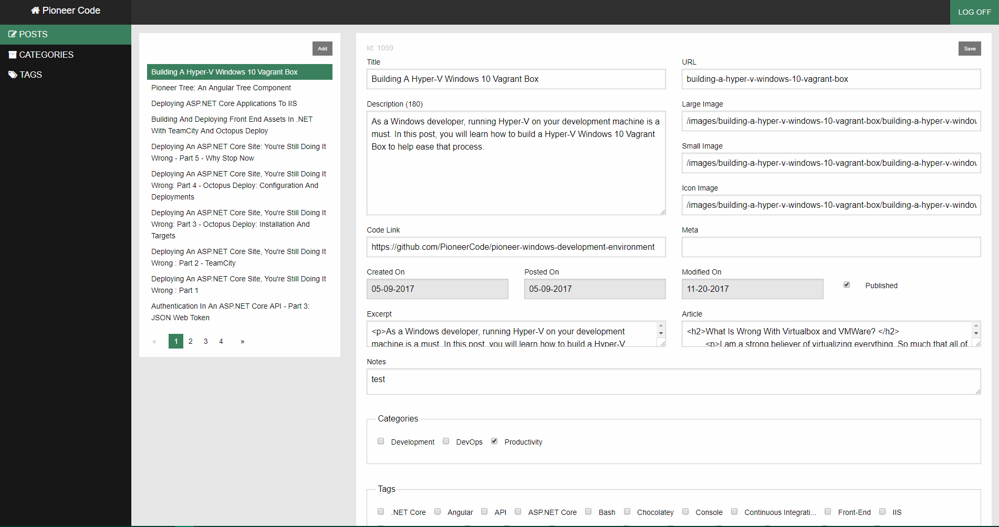

# Pioneer Blog
Thanks to pioneer blod (Original Code Owned by pioneer blog)

Active code based used for [Pioneer Code](https://pioneercode.com).

Current stack...
- ASP.NET Core 2.x
- Entity Framework Core 2.x
- Angular 5.x

Current deployment...
  
Wiki
 - [How do I set Pioneer Blog up?](https://github.com/PioneerCode/pioneer-blog.git)

## Admin 
Full-featured admin portal.

## What is coming in the future

- If your curious what is coming down the pipe, I track features as [issues](https://github.com/PioneerCode/pioneer-blog/issues).
- If there is interest, I am willing to entertain the idea of abstracting the vast majority of code away from the Pioneer Blog domain so that it can't be reused without to much refactoring.  

## [CHANGELOG](CHANGELOG.md)
hello
